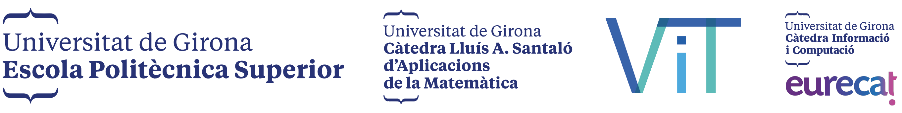

# Màster in Data Science UdG: Hackathon Infoviz and Project Management

 

This hackathon is a shared event between the Information Visualization and Data Science Project Management subjects with support from the [ViT Foundation](https://www.fundaciovit.org/).

**💡 What we want to solve:**

We want to propose a **new metric about the impact of air pollution (PM2.5) on human health**, based on **publicly-available open data** and use it to inform the public about the risks of air pollution and enable policy-makers to make regulatory decisions based on evidence.

**🔍 Specifically ...**

* How to calculate the metric every time new data rolls in.
* How to aggregate the data into different administrative units.
* How to identify 'hotspots'.
* What to say about it and how to display it.

**🧑‍🎓 What you will learn:**

* To wear different hats in a project: data scientist, project manager, data storyteller, researcher ...
* To collaborate with new teams and across teams —everyone has something that other teams need and needs something from other teams.
* To set realistic, yet aspirational expectations.
* To set and follow best practices for technical collaborations.
* To process, analyze and visualize geospatial data.
* To present results to stakeholders.

**📅 Pre-hackathon stuff:**

* Read this repo in detail
* Meet to discuss and distribute roles
* Decide on the communication channels, management and documentation tools
* Set up your computer if you need to download or install any software —don't do it the day of the hackathon, please!

> **⚠ IMPORTANT NOTE:**  
> The entire group will collaborate on the same repo, so read the [Collaboration recommendations](#collaboration-recommendations).

## OUR FOCUS: Health impact of PM2.5 pollution

Our ['raw data'](https://mitpress.mit.edu/books/raw-data-oxymoron) is SEDAC's satellite-derived Global Annual PM2.5 Grids. SEDAC is a data center in NASA's Earth Observing System Data and Information System. The estimates in this indicator are intended to help in large-scale health and environmental studies. The gridded data sets provided have a resolution of 0.01 degrees to allow researchers to agglomerate data to meet their particular needs.

Here're [more detailed explanations about the data](https://sedac.ciesin.columbia.edu/data/set/sdei-global-annual-gwr-pm2-5-modis-misr-seawifs-aod-v4-gl-03).

The [Air Quality Life Index](https://aqli.epic.uchicago.edu/) by the Energy Institute at the University of Chicago is one of the better known and better documented models right now —which you can use as a reference in any way, shape or form you like. Please read their [methodology](https://aqli.epic.uchicago.edu/about/methodology/), it contains details relevant to all teams.

## Some helpful tools
* QGIS: a free and open source mapping software https://qgis.org/en/site/
* Mapping with Plot https://observablehq.com/@observablehq/plot-mapping
* Mapping with GeoTIFFs Python https://towardsdatascience.com/reading-and-visualizing-geotiff-images-with-python-8dcca7a74510

## Teams and objectives

### 🧐 From grids to communities

|**Team name:** owls 🦉|
|:------|
|**Members:** Joan, Roser, Elmo, Marwa, David|

**Question:** How can we aggregate the gridded data into relevant administrative units? 

**Goal:** Automate the pipeline that summarizes the annual PM2.5 values from a gridded data format (TIFFs in this case) to administrative units (country, region, province).

**Deliverables:**

* Data files with the PM2.5 values aggregated by the different levels of admin units —to be negotiated with the pandas 🼠team
* Visualizations of the input data and the output
* Documentation of the process —using the visuals generated

### 🤔 From air pollution to life years

|**Team name:** pandas 🐼|
|:------|
|**Members:** Josep, Nil, Ivan, Xavier, Llorenç, Denisse|

**Question:** How can we transform it into a measure of health impact?

**Goal:** Design the model (weighted by population) that converts PM2.5 pollution into years of life expectancy lost

**Deliverables:**

* Data files with the different levels of admin units for a country —to be negotiated with the rhinos 🦏 team
* Visualizations of the output files at different levels
* Documentation of the process —using the visuals generated

### 🌍 From data to action

|**Team name:** rhinos 🦏|
|:------|
|**Members:** Judit, Wilber, Samuel, Isaac, Feng|

**Question:** How can we inform citizens and policy-makers about the issue?

**Goal:** Prototype an interactive country-level report about the impact of PM2.5 pollution for policy-makers

**Deliverables:**

* Brief summary of the methodology used by the pandas 🐼 and the rhinos 🦏
* A criteria to determine country hotspots
* ObservableHQ notebook with the prototype that helps policy-makers simulate different pollution-reduction scenarios

## Day-of schedule

The Hackathon takes place in the P-IV building, EPS UdG on February 12, 2022.

We will provide breakfast 🥐, lunch 🥪, snacks 🍌, coffee ☕ ...

* 👋 **09:00** Welcome, reminder of logistics like working rooms, lunch, drinks, communication channels ...
* 🙋‍♀️ **09:15** Standup meeting. Objectives, processes, what you want to achieve in the hackathon and any questions.
* 👩‍💻 **09:30** Start of work day!
* 🙋‍♀️ **13:15** Short standup
* 🍱 **13:30** Lunch
* 👩‍💻 **14:30** Back to work
* 🧑‍🏫 **19:00** Wrap-up presentation < 6 slides 😜: About 10 minutes per team, in English.
  * What was achieved?
  * What was helpful?
  * What’s left to do?
* 🏆 **19:30** Awards
* 🥳 **20:00** End!!!

*We'll come to you, moving from group to group, and we'll be available for questions and solving blocks.*

## Collaboration recommendations

* Use folders and file names that are human-readable and let you identify the content, preferably use lower case separated by dashes. For example: `areas-of-interest-getis-ord.py`
* Follow the Branch Per Feature model: one feature, one branch.
* Prepend each branch with your team name. For example if you're commiting part of your work cleaning up the data, you would push it to a `owls--data-cleaning` branch.
* Use a consistent pattern for commit messages, a nice one is `type of commit: description of the commit in imperative mood` as in `refactor: use map instead of for loop`.

## The awards

As we all know the [professional jury and the popular vote don't always match](https://www.youtube.com/watch?v=4uGN9efcACw), so we're offering two awards: you all decide one via an open vote, we decide the other —which may or may not be the same, and we won't know until we reveal them simultaneously. There will be an guest judge and the presentation must be in English.

* [**Vote for your favorite for the popular vote award here**]()

* 🏆 **Popular vote:** A copy of [Data sketches: A journey of imagination, exploration, and beautiful data visualizations](https://www.datasketch.es/) by Nadieh Bremer and Shirley Wu
* 🏆 **Jury fav:** A copy of [Data Feminism (Strong Ideas)](https://datafeminism.io/) by Catherine D'Ignazio and Lauren F. Klein

## Our evaluation criteria

For the **Project Management** subject:

* **50%:** Active participation and engagement with the given roles —part of it will be our observation, part of it will be self and peer evaluation within the teams.
* **30%:** Delivery of the presentation of the results.
* **20%:** Creativity, feasibility and accuracy of the deliverables.

Remember that hackathon will count for [**25% of the final mark for the subject**.](https://www.udg.edu/ca/estudia/oferta-formativa/Oferta-dassignatures/Detall-assignatura?curs=2022&codia=3501MO3316#avaluacioQualificacio)

Self and peer evaluation forms:

* [Team owls 🦉]()
* [Team pandas 🐼]()
* [Team rhinos 🦏]()

For the **Information Visualization** subject:

* All attending students in the winning groups get +1 (if the popular vote coincides with the jury fav they get +2)
* All other attending students get +0.4 for their participation.
* We will take into account the creativity and how well the visualization displays the results.