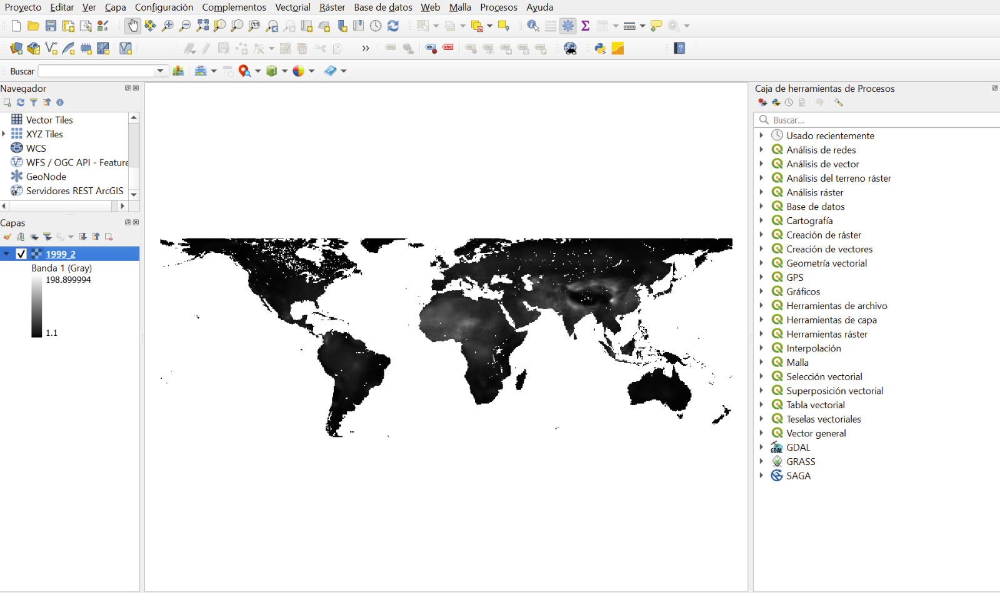
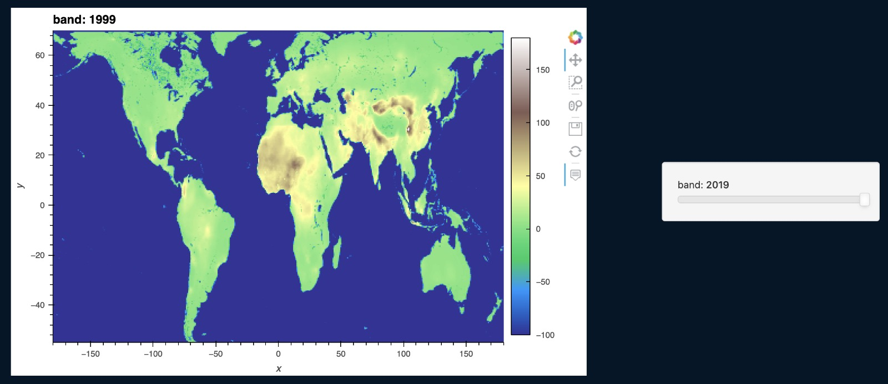
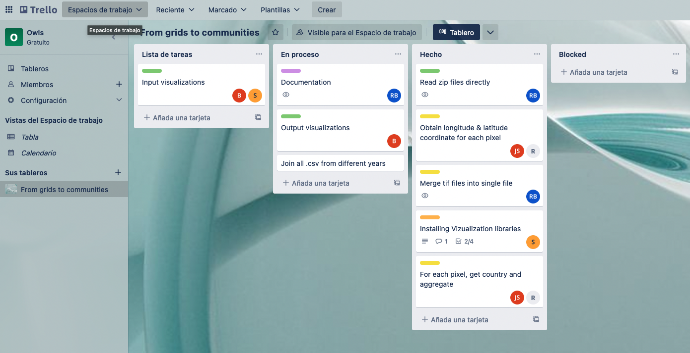

# Owls Team 🦉

## Index
[1. Members](#1.-Members)

[2. Objectives](#2.-Objectives)

[3. Project Implementation](#3.-Project-Implementation)
- [3.1 Data Preprocessing & transformation](#3.1-Data-preprocessing-&-transformation)
- [3.2 Data visualization](#3.2-Data-visualitzation)

[4. PM Tools](#4.-PM-Tools)

## 1. Members
The owls team is composed by the following members in 3 different roles:

|**Member**|**Role**|**Tasks**|
|:------|
|Joan Saló|Data Engineer|Data preprocesing|
|David Galer|Data Engineer|Data preprocessing|
|Marwa Ben Amar|Data Scientist|Data visualization|
|Elmo Chávez|Data Scientist|Data visualization|
|Roser Brugués|Project Manager|Documentation & support in other IT tasks|

## 2. Objectives

### 🧐 From grids to communities

**Question:** How can we aggregate the gridded data into relevant administrative units? 

**Goal:** Automate the pipeline that summarizes the annual PM2.5 values from a gridded data format (TIFFs) to administrative units (country, region, province).

**Deliverables:**

* Data files with the PM2.5 values aggregated by the different levels of admin units —to be negotiated with the pandas 🐼 team
* Visualizations of the input data and the output
* Documentation of the process —using the visuals generated

## 3. Project Implementation
The first and most important task has been to decide the roles of each of us and understand the data we have.

We have met and discussed the problem altogether and discussed about raster and geospatial data, which was something new for most of the team. Joan and Roser, who have worked in the past in this kind of data, did a quick class to the rest so we all understand the basics of raster data and how to transform it and map it with poligons data.

In order to achieve our goals and mission into this collaborative project, we have split the tasks in 2 differents steps, which one follows the other.

### 3.1 Data preprocessing & transformation
First of all, we need to digest and preprocess the data. This means we have to deal with raster data, which all are in `*.tiff` extension.
The problem with this kind of files is that tend to be very large and processing them gets difficult and takes time. After trying with the original files and experiencing several problems, we have decided to perform a **downsampling** of the files to reduce the raster resolution, meaning the matrix is smaller.
We also have performed a merging with the reduced files so we can have it in a single `.tiff` file and visualize it with an interactive library. Each year (or file) is mapped in a different band on the resulting raster file.

#### Libraries used
Raster data needs very specific libraries and software:
- **GDAL**: GDAL is a translator library for raster and vector geospatial data formats that is released under an MIT. More information can be found [here](https://gdal.org/).
- **GEOPANDAS**: GeoPandas is an open source project to make working with geospatial data in python easier. GeoPandas extends the datatypes used by pandas to allow spatial operations on geometric types. More information can be found [here](https://geopandas.org/en/stable/).

#### Specific software used
- **QGIS**: It's an open-source software that it is useful to create, edit, visualize and analyze geospatial and raster data. We have used it to explore easily the raster data and perform a **downsampling** on the original files to work with less large files and digest them faster. More information can be found [here](https://www.qgis.org/es/site/).

### 3.2 Data visualization
The visualization of the data is split in 2 different parts: input data & output data

#### Input data
The visualization of the input data is basically plot the raster or vector files. Observable HQ does not support this kind of files, at least from our present knowledge. So we've opted to plot and explore the input data with a jupyter notebook and use specific libraries for that purpose.

To do that, we have use the merged file with all tiff and each year is a raster band in the file, and with an interactive library, the year can be chosen.

##### Libraries used
Visualise geospatial data needs dedicated libraries. We've used the following:
- **GEOVIEWS**: GeoViews is a Python library that makes it easy to explore and visualize geographical, meteorological, and oceanographic datasets, such as those used in weather, climate, and remote sensing research. More information can be found [here](https://pypi.org/project/geoviews/).
- **XARRAY**: Xarray makes working with labelled multi-dimensional arrays in Python simple, efficient, and fun. More information can be found [here](https://docs.xarray.dev/en/stable/).
- **HVPLOT**: A familiar and high-level API for data exploration and visualization. More information can be found [here](https://hvplot.holoviz.org/).
- **RASTERIO**: Rasterio reads and writes geospatial raster data. More information can be found [here](https://github.com/rasterio/rasterio).

#### Output data
The visualization of the output data is plot the transformed data from the raster files. The output data is extracted in a `*.csv` file with the following fields:
- `iso_code` country iso code (3 characters)
- `year`  year of the data
- `min`  minimum value for that year
- `max`  maximum value for that year
- `avg`  Average value for that year

We have ploted the data in an Observable HQ notebook, which enable us to use different kinds of libraries to plot the data in a worldwide map.

## 4. PM Tools
As a PM tool we have used **Trello**.

Trello for the PM and task organization. We have splited the tasks in for different epics/labels
- Documentation
- Data visualization
- Data preprocessing
- Library installation
